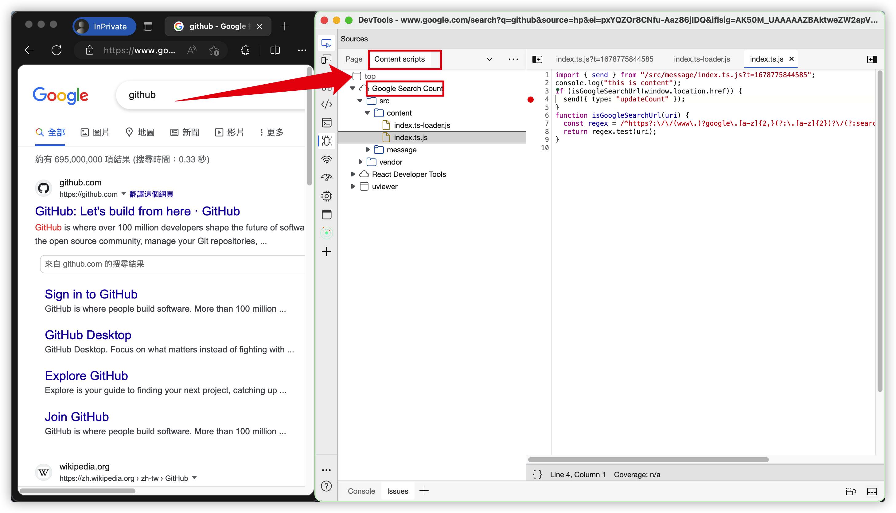
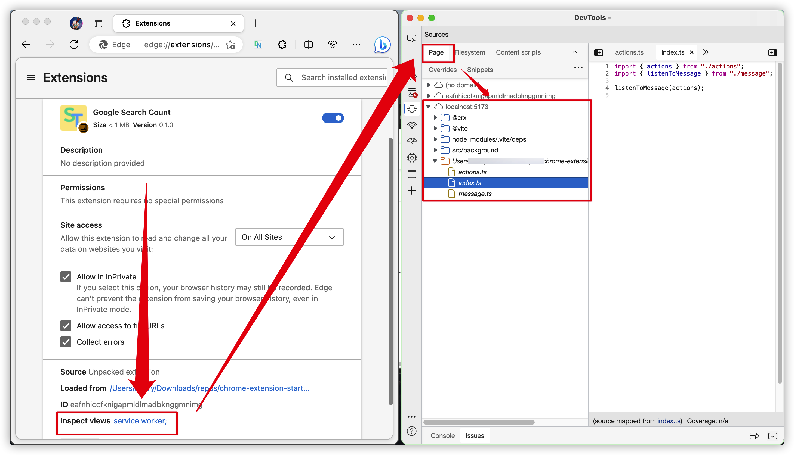
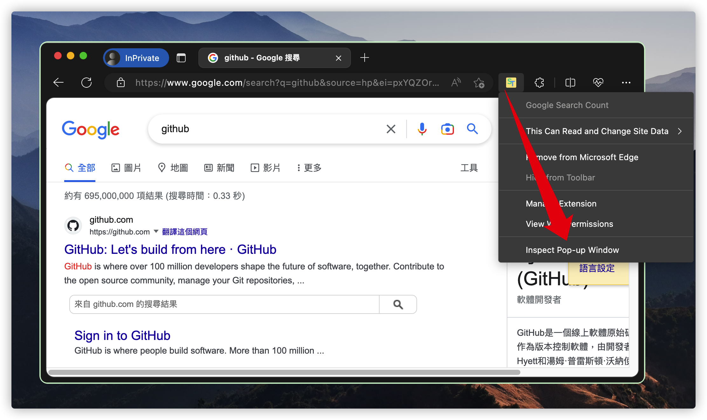
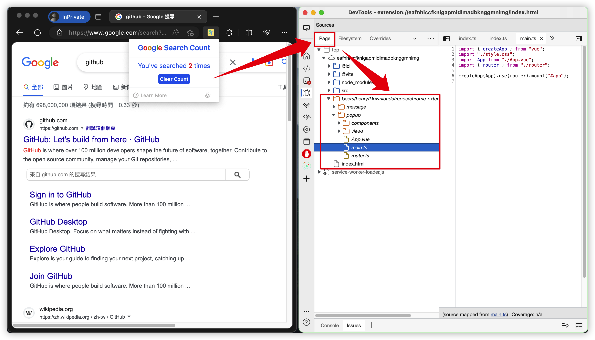

# Chrome Extension TypeScript Starter

## 简介

这是一个 Chrome 插件项目模板，主要使用到了以下 Package

- Vite
- Vue3
- Tailwind

并使用到了以下 Package 增强开发体验

- TypeScript：使用 TypeScript 规范了 background script、content script 以及 popup script 之间的通信格式，并提供了完善的类型提示。
- CRX.js：使用 CRX.js 定义 `manifest.json`，自动创建 vite 打包入口，并为 popup 提供热更新。
- lint-staged：在提交前检查代码。
- git-cz：生成标准提交信息。

## 初始化

1. 启动项目

```bash
pnpm i
npm run prepare
npm run dev
```

2. 在浏览器中加载 `dist` 下生成的插件源码

## 谷歌搜索计数器

该模板中包含一个谷歌搜索计数与清除功能，用于展示开发 Chrome 插件过程中的一些常见模式，例如

- [content script 获取页面信息](https://github.com/HenryC-3/chrome-extension-starter/blob/56714a4d3305a92a158d634b95fa5f49f5af8802/src/content/index.ts#L4)
- [content、popup、background 三者间的通信模式](https://github.com/HenryC-3/chrome-extension-starter/blob/56714a4d3305a92a158d634b95fa5f49f5af8802/src/popup/views/HomePage.vue#L22-L24)
- [使用 IndexDB 持久化数据](https://github.com/HenryC-3/chrome-extension-starter/blob/56714a4d3305a92a158d634b95fa5f49f5af8802/src/background/actions.ts#L8-L15)

## 调试

调试 Chrome 插件有点麻烦，content script、background script 以及 popup script 均需要打开对应的 Devtool 才能调试，且三者的执行时机各不相同。

<details>
<summary>调试 content script</summary>
<br>

content script 随匹配页面加载执行，因此在调试前，确保已打开了与 manifest 中配置相匹配的页面，例如 [google search github](https://www.google.com/search?q=github&source=hp&ei=pxYQZOr8CNfu-Aaz86jIDQ&iflsig=AK50M_UAAAAAZBAktweZW2apV8D9OI6XUVaXiDh48eqb&ved=0ahUKEwiq7J_t59r9AhVXN94KHbM5CtkQ4dUDCAo&uact=5&oq=github&gs_lcp=Cgdnd3Mtd2l6EAMyCwguEIAEEMcBENEDMgsIABCABBCxAxCDATILCAAQgAQQsQMQgwEyCwgAEIAEELEDEIMBMggIABCxAxCDATILCAAQgAQQsQMQgwEyCAgAELEDEIMBMgsIABCABBCxAxCDATIFCAAQgAQyCwgAEIAEELEDEIMBOhEILhCABBCxAxCDARDHARDRAzoICAAQgAQQsQM6FAguEIAEELEDEIMBEMcBENEDENQCOggILhCxAxCDAToICC4QgAQQ1AI6BQguEIAEOhMILhCABBCxAxCDARDHARDRAxAKOg0IABCABBCxAxCDARAKOgcIABCABBAKUKsDWOs0YPI4aARwAHgGgAH3BIgBpCmSAQkyLTIuMC40LjWYAQCgAQGwAQA&sclient=gws-wiz)

打开当前页面的 Devtool，找到 `source>content script>google search count` 下的源码文件进行调试。



</details>

<details>
<summary>调试 background script</summary>
<br>

插件激活状态下，background script 在浏览器启动后执行。调试 background script 时，首先打开插件详情页，点击 inspect views service worker 打开 Devtool， 找到 `source>page>localhost` 下的源码文件进行调试。



</details>

<details>
<summary>调试 popup script</summary>
<br>

popup script 在 popup 打开时执行。右键点击插件图标后，点击 inspect popup view 打开 Devtool，找到 `source>page` 下的源码进行调试





</details>
